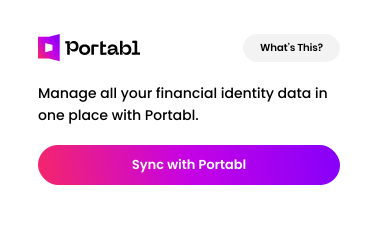

  <a href="https://docs.getportabl.com">
    <picture></picture>
    <h1 align="center">Portabl SDKs</h1>
  </a>
  <strong>Official Portabl SDKs for Sync and Connect </strong>

## Integrations

Portabl provides integrations for **Sync** and **Connect**. Below you will find the SDKs needed to implement them.
Please reference [Getting Started](https://docs.getportabl.com/docs/getting-started/) to learn more.

### Sync

Sync is an integration that enables you to issue reusable and trustable data. FS Consumers can use this data to prove their identity to other FS Providers. **([Docs](https://docs.getportabl.com))**

#### Client Side SDKs

- `js-sync-with-portabl`: JS + HTML implementation of the Sync with Portabl module
- `react-sync-with-portabl`: React implementation of the Sync with Portabl module

### Connect

Connect is an integration that enables **FS Consumers** to share verified credentials with **FS Providers** in order to prove their identity. **(Docs - _Coming Soon!_)**

#### Client Side SDKs

- `js-connect-with-portabl`: JS + HTML implementation of the Connect with Portabl button
- `react-connect-with-portabl`: React implementation of the Connect with Portabl button
- `react-native-connect-with-portabl`: React Native implementation of the Connect with Portabl button
- `vue-connect-with-portabl`: Vue implementation of the Connect with Portabl button

---

## Contributing

Want to contribute? Awesome! Take a look at some helpful setup instructions [here](./CONTRIBUTING.md).
